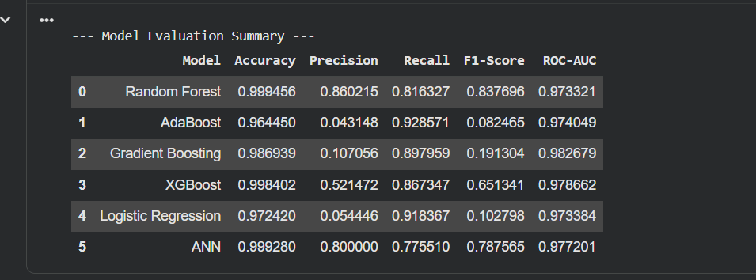
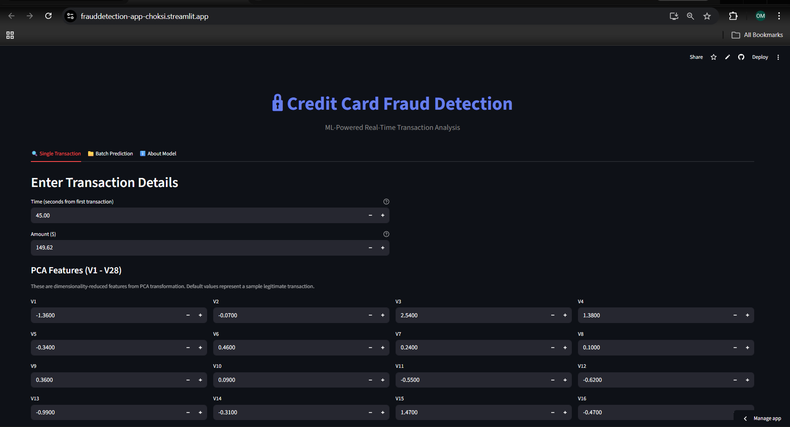
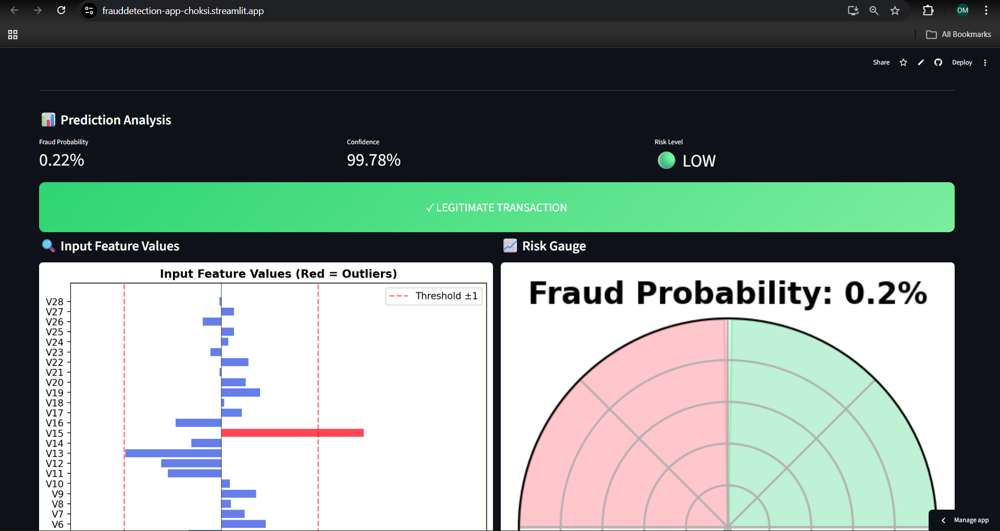
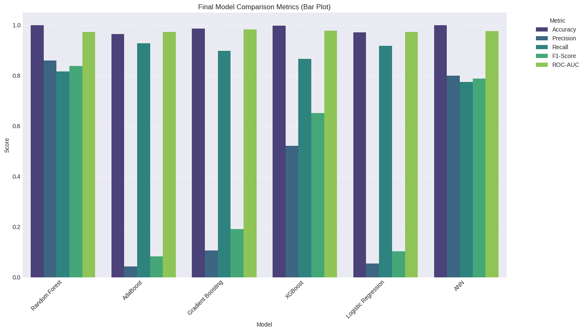
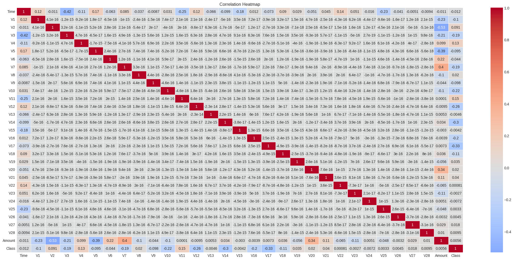
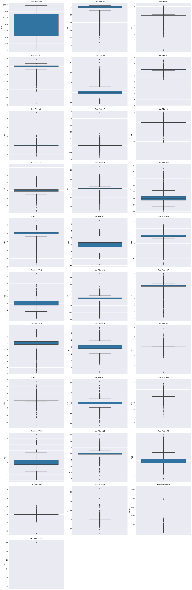
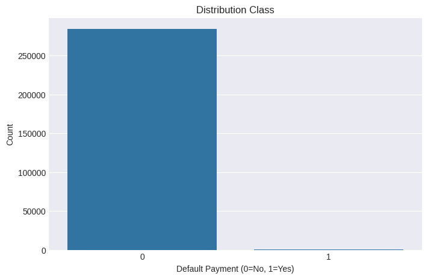

# 🔒 Credit Card Fraud Detection System

<p align="center">
  
  
  
</p>

## 🚀 Live Demo

**🔗 Streamlit App:** https://frauddetection-app-choksi.streamlit.app/

Experience real-time fraud detection with our interactive web interface!

---

## 📊 Project Overview

This project implements a **Credit Card Fraud Detection System** using machine learning to identify potentially fraudulent transactions in real-time. The model is trained on the Kaggle Credit Card Fraud Detection dataset containing 284,807 transactions.

### Key Features:
- ✅ Real-time transaction fraud prediction
- ✅ Batch processing for multiple transactions
- ✅ Interactive feature visualization
- ✅ Risk analysis with actionable insights
- ✅ User-friendly Streamlit interface

---

## 🎯 Model Summary

### Algorithm
| Component | Details |
|-----------|---------|
| **Model** | XGBoost Classifier |
| **Feature Selection** | Top 20 important features from PCA-transformed data |
| **Preprocessing** | StandardScaler for V1-V28, Z-score normalization for Amount & Time |

### Input Features
- **V1 - V28**: Principal Component Analysis (PCA) transformed features
- **Amount**: Transaction amount in USD
- **Time**: Seconds elapsed since the first transaction

### Performance Metrics
The model achieves:
- **High Recall**: Catches most fraudulent transactions
- **Balanced Precision**: Minimizes false positives
- **Class Imbalance Handling**: SMOTE/undersampling techniques applied

---

## 🏗️ Project Structure

```
MLINNOVATEX/
│
├── app.py                        # Flask API for predictions
├── streamlit_app.py              # Streamlit web interface
├── CreditCardFraudDetection_ML.ipynb  # Model training notebook
│
├── Models/
│   ├── best_model_xgb.pkl        # Trained XGBoost model
│   ├── scaler.pkl                # Feature scaler
│   └── top_features.pkl          # Selected feature names
│
├── frontend/
│   ├── index.html                # HTML frontend
│   └── script.js                # JavaScript for API calls
│
├── static/                       # Static files (CSS/JS)
├── templates/                    # HTML templates
│
├── requirements.txt              # Python dependencies
├── Dockerfile                    # Docker configuration
├── Procfile                      # Deployment config
└── README.md                     # Project documentation
```

---

## 🖥️ Application Screenshots

### 1. Model Summary & Performance


### 2. Frontend Interface


### 3. Prediction Results


### 4. Model Comparison


### 5. Data Distribution


### 6. Feature Correlation


### 7. Outlier Detection


### 8. Class Distribution


---

## 🧮 Flask API Documentation

### Endpoint: `/predict`

**Method:** `POST`

**Request:**
```json
{
  "features": {
    "V1": -1.36,
    "V2": -0.07,
    "V3": 2.54,
    ...
    "Amount": 149.62,
    "Time": 0.0
  }
}
```

**Response:**
```json
{
  "prediction": 0,
  "probability": 0.0234
}
```

- `prediction`: 0 = Legitimate, 1 = Fraud Detected
- `probability`: Fraud probability (0-1)

---

## 🚀 Deployment

### Streamlit Cloud Deployment
The application is deployed on **Streamlit Cloud**:  
🔗 https://frauddetection-app-choksi.streamlit.app/

### Local Deployment

```bash
# Clone the repository
git clone https://github.com/OMCHOKSI108/FraudDetection.git
cd FraudDetection

# Install dependencies
pip install -r requirements.txt

# Run Streamlit app
streamlit run streamlit_app.py
```

### Docker Deployment

```bash
# Build Docker image
docker build -t fraud-detection .

# Run container
docker run -p 5000:5000 fraud-detection
```

### Flask API Deployment

```bash
# Run Flask app
python app.py
# API available at http://localhost:5000
```

---

## 📦 Requirements

```
streamlit>=1.28.0
xgboost>=2.0.0
scikit-learn>=1.3.0
pandas>=2.0.0
numpy>=1.24.0
matplotlib>=3.7.0
seaborn>=0.12.0
joblib>=1.3.0
flask>=3.0.0
```

---

## 📖 Usage Guide

### Single Transaction Detection
1. Open the Streamlit app
2. Enter transaction details (Time, Amount, V1-V28 features)
3. Click "Detect Fraud" button
4. View prediction, probability, and risk analysis

### Batch Processing
1. Go to "Batch Prediction" tab
2. Upload CSV file with transaction data
3. Click "Process Batch" button
4. Download results with fraud predictions

### Quick Examples
Use pre-loaded examples:
- 📊 Sample Legitimate - Normal transaction
- ⚠️ High Amount Fraud - Large fraudulent transaction
- ⚠️ Low Amount Fraud - Small fraudulent transaction

---

## 🔍 Feature Interpretation

| Feature | High Negative Value | High Positive Value |
|---------|---------------------|---------------------|
| V14, V17 | Likely Fraud ⚠️ | Likely Legit ✓ |
| V12, V10 | Likely Fraud ⚠️ | Likely Legit ✓ |
| Amount | High Amount | Normal Amount |
| Time | Unusual Hours | Business Hours |

---

## 📝 Author

**Om Choksi**  
Machine Learning Developer | AIML316 - Advance Machine Learning with Python

---

## 📄 License

This project is for educational purposes.

---

## 🙏 Acknowledgments

- Kaggle for the Credit Card Fraud Detection dataset
- XGBoost for the machine learning algorithm
- Streamlit for the beautiful UI framework
- The open-source ML community

---

<p align="center">
  <b>🔒 Secure Your Transactions with AI 🔒</b>
</p>